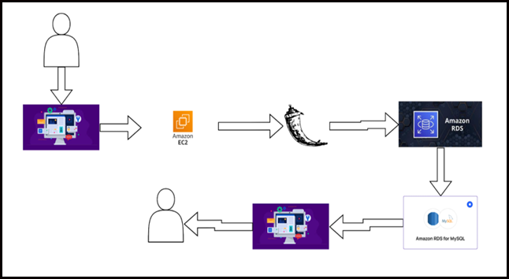

# AWS-virtual-classroom

A scalable, secure, and user-friendly cloud-based virtual classroom platform developed using **Amazon Web Services (AWS)** and **Flask**. The system is designed to support online learning environments through real-time communication, secure content hosting, and data-driven analytics.

---

## Objectives

1. Develop a user-friendly and scalable virtual classroom platform.  
2. Integrate real-time communication for live lectures and discussions.  
3. Provide secure storage and retrieval of educational resources.  
4. Monitor student engagement and performance through data analytics.  
5. Ensure high availability and fault tolerance of the platform.

---

##  Key AWS Components

| Service | Function |
|----------|-----------|
| **Amazon EC2** | Hosts and deploys the Flask application. |
| **Amazon S3** | Stores course materials such as lecture notes and videos. |
| **Amazon RDS (MySQL)** | Manages user data, course metadata, and authentication. |
| **AWS CloudWatch** | Monitors application performance and system health. |
| **AWS IAM** | Implements role-based access and security policies. |

---

##  Core Features

- **User Management:** Secure registration, login, and role-based access for students, teachers, and administrators.  
- **Course Material Handling:** Upload, update, and retrieve resources through AWS S3 integration.  
- **Scalable Architecture:** Elastic Load Balancing ensures efficient traffic distribution.  
- **Data Analytics:** AWS QuickSight provides insights into student engagement and performance.  
- **Security:** IAM roles and end-to-end encryption protect data and access credentials.

---

##  Implementation Summary

1. Configure **Amazon RDS** for database management.  
2. Connect the RDS instance with **MySQL Workbench**.  
3. Launch and configure an **EC2 instance** for application deployment.  
4. Deploy the **Flask application** on EC2 with appropriate security groups and key pairs.  
5. Integrate **AWS S3** for course content storage.  
6. Enable **CloudWatch** monitoring and IAM access control.

---

##  System Architecture

*(Insert a diagram or screenshot here)*  
Example:  

---

##  Future Enhancements

- Integration of **AWS Chime SDK** or **WebRTC** for live classes.  
- AI-driven recommendations for personalized learning.  
- Development of a **mobile application interface**.  
- Enhanced analytics dashboards using AWS QuickSight.

---

## Documentation

The complete project documentation is available in the [`aws.pdf`](aws.pdf) file.

---

## Author

**Sailaja S**  
Project: *Virtual Classroom in AWS*  
Platform: *Amazon Web Services (AWS)*  
Framework: *Flask (Python)*

---

